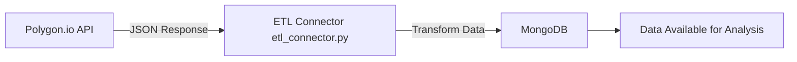

# **Polygon ETL Data Connector**
A Python-based ETL (Extract, Transform, Load) connector for fetching financial market data from the **Polygon.io API** and storing it into a MongoDB database. Built as part of the Software Engineering course assignment.

---

## **📌 Features**
- Fetches stock market data from Polygon.io
- Loads data into MongoDB
- Environment variables for API keys and DB config
- Modular code structure for easy extension
- `.gitignore` for secure API key handling

---

## **🛠 Tech Stack**
- **Python 3**
- **Requests** — API calls
- **Pymongo** — MongoDB integration
- **dotenv** — Environment variable handling
- **Polygon.io API**

---

## **📂 Project Structure**
```
custom-python-etl-data-connector-Niranjan0002/
│
├── polygon-connector/
│   ├── etl_connector.py        # Main ETL script
│   ├── requirements.txt        # Python dependencies
│   ├── README.md               # Component-specific info
│   ├── .gitignore              # Ignore secrets & cache
│
├── README.md                   # Main project documentation
└── .github/                    # GitHub Classroom config
```

---

## **⚙️ Setup & Installation**
1. **Clone the repository**
```bash
git clone https://github.com/Kyureeus-Edtech/custom-python-etl-data-connector-Niranjan0002.git
```
2. **Create and activate a virtual environment**
```bash
python -m venv venv
source venv/bin/activate   # Mac/Linux
venv\Scripts\activate      # Windows
```
3. **Install dependencies**
```bash
pip install -r polygon-connector/requirements.txt
```
4. **Create a `.env` file in `polygon-connector/`**
```
POLYGON_API_KEY=your_api_key_here
MONGO_URI=mongodb://localhost:27017
```

---

## **🚀 Usage**
Run the ETL script:
```bash
python polygon-connector/etl_connector.py
```

---

## **📊 Architecture**



---

## **📌 Author**
**Niranjan B**  
Roll No: 3122225001082
