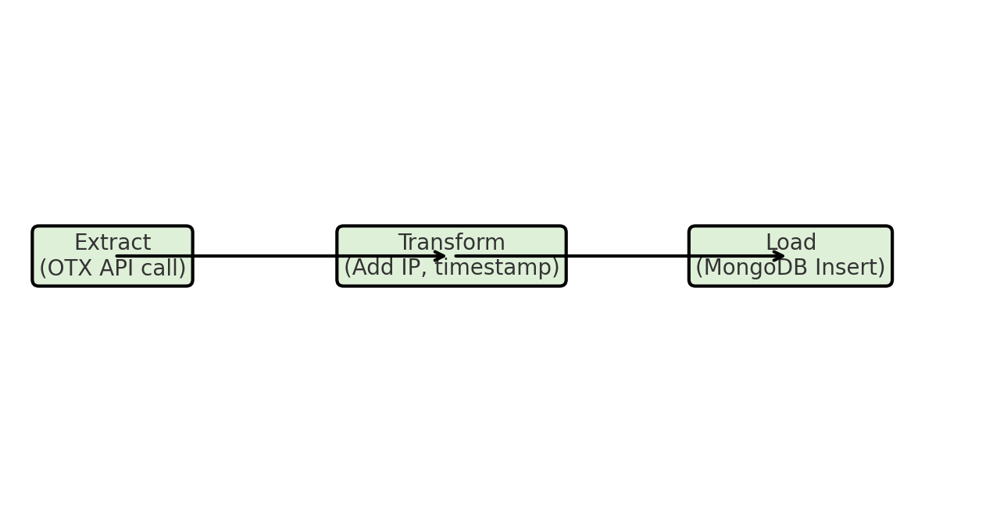

# OTX IOC Details ETL Connector

## Overview
This ETL connector retrieves Indicator of Compromise (IOC) details for IPv4 addresses from the **AlienVault OTX API**, transforms the data for MongoDB storage, and loads it into a local or cloud MongoDB collection.

The pipeline follows the **Extract → Transform → Load** model and stores an ingestion timestamp for each record.

---

## ETL Pipeline Diagram


---

## API Details
- **Base URL:** `https://otx.alienvault.com`
- **Endpoint:** `/api/v1/indicators/IPv4/{ip}/general`
- **Authentication:** API Key in `X-OTX-API-KEY` header
- **Response Format:** JSON

Example request:
```bash
curl -H "X-OTX-API-KEY: <your_api_key>" https://otx.alienvault.com/api/v1/indicators/IPv4/8.8.8.8/general
```

---

## Environment Variables
All sensitive credentials are stored in `.env` and not committed to Git.
A sample `ENV_TEMPLATE` is provided:

```env
OTX_API_KEY=your_otx_api_key_here
MONGO_URI=mongodb://localhost:27017
MONGO_DB=sa
MONGO_COLLECTION=otx_ioc_details_raw
```

---

## Folder Structure
```bash
otx-connector/
├── etl_connector.py      # Main ETL script
├── ENV_TEMPLATE          # Sample environment variables
├── requirements.txt      # Python dependencies
├── README.md             # Documentation
├── .gitignore            # Ignore .env and cache
└── .env                  # Actual credentials (not committed)
```

---

## How to Run

1. **Install Dependencies**
```bash
pip install -r otx-connector/requirements.txt
```

2. **Create `.env` file**
```env
OTX_API_KEY=<your_real_otx_api_key>
MONGO_URI=mongodb://localhost:27017
MONGO_DB=sa
MONGO_COLLECTION=otx_ioc_details_raw
```

3. **Run the ETL Script**
```bash
python otx-connector/etl_connector.py
```

4. **Verify in MongoDB**

Using `mongosh`:
```bash
mongosh
use sa
db.otx_ioc_details_raw.find().pretty()
```

Or using **MongoDB Compass**.

---

## Sample MongoDB Output
Example document stored in MongoDB after running the ETL connector:
```json
{
  "_id": { "$oid": "66b999a8f1a23a2d18a2c123" },
  "ip": "8.8.8.8",
  "data": {
    "indicator": "8.8.8.8",
    "type": "IPv4",
    "asn": "AS15169",
    "country_name": "United States",
    "latitude": 37.751,
    "longitude": -97.822,
    "pulse_info": {
      "count": 5,
      "pulses": [
        { "id": "12345", "name": "Suspicious IP", "created": "2024-08-10T12:00:00" }
      ]
    }
  },
  "ingested_at": { "$date": "2024-08-14T08:55:12Z" }
}
```

---

## Error Handling
- Invalid IP addresses return **400 Bad Request**.
- Missing or invalid API key returns **401 Unauthorized**.
- Network errors are caught and logged.

---

## Author
- **Name:** Niranjan B
- **Roll No:** <your_roll_number>
- **Section:** <your_section>
